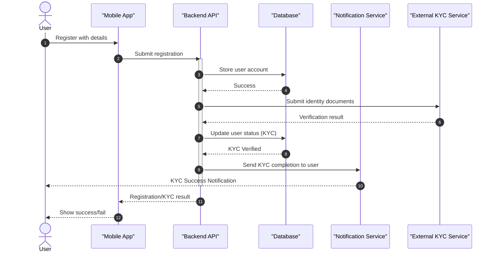
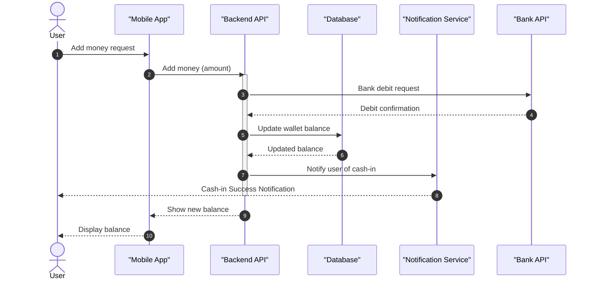
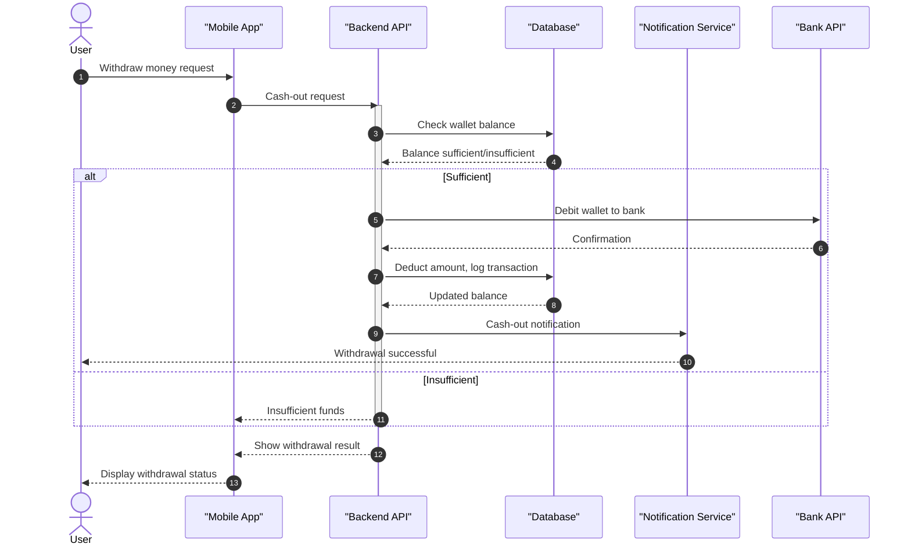
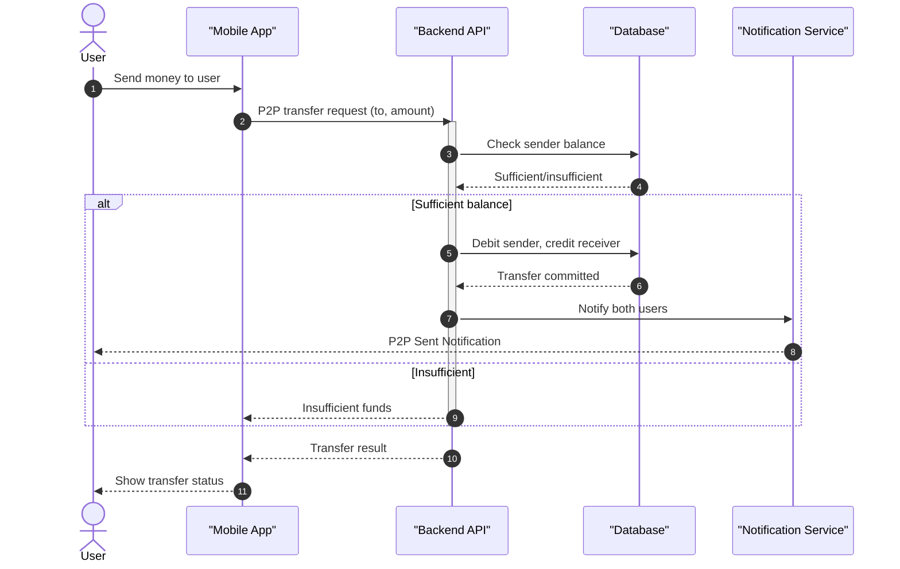
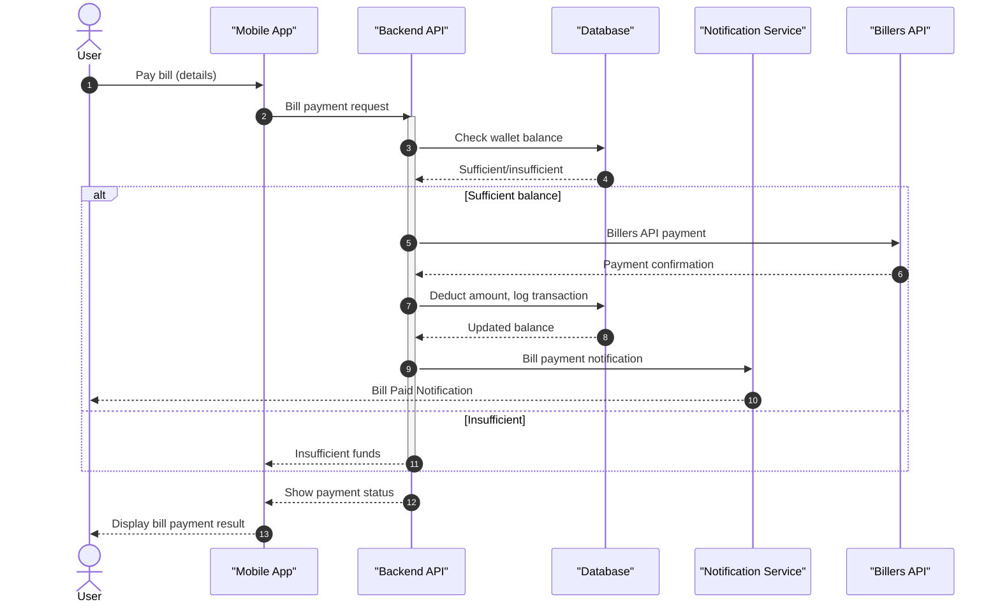
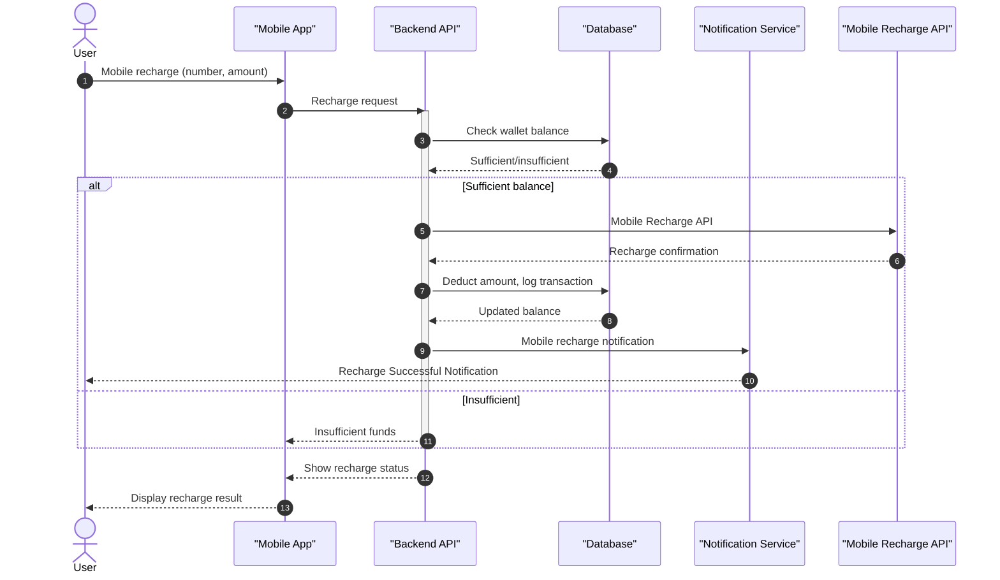
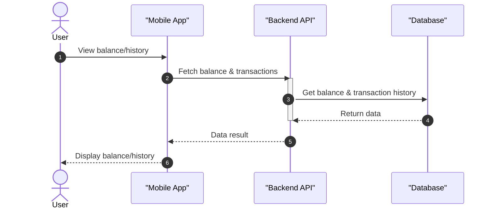
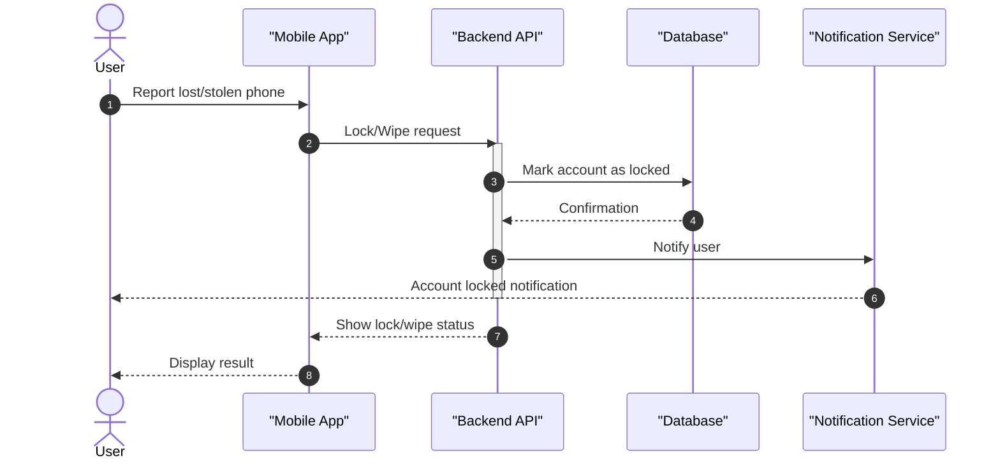

# 🪙GoPay 
GoPay is a **mobile wallet system** that allows users to **store, send, and receive money** digitally.It provides a simple, secure, and fast way to handle financial transactions.  

------------------------------------------------------------------------------------------------------

# 1. Overview
GoPay enables:  
- Peer-to-Peer (P2P) money transfers.  
- Cash in/out via agents or bank integration.  
- Bill payments (electricity, water, internet, etc.).  
- Mobile recharge
- QR-based payments at merchants.    
- Remote Lock/Wipe in case of lost or stolen phone. 

------------------------------------------------------------------------------------------------------

# 2. Scope

### 👤 Users Features 
- Register & verify account (KYC).  
- Add money (cash in) & withdraw (cash out).  
- Send/receive money to other users.  
- Pay bills. 
- Mobile recharge 
- QR payments at merchants.  
- View transaction history & wallet balance.   
- Notifications for all transactions.  
- Remote lock/wipe in case of lost phone.  
- Profile management.   

### 🛠️ Admin Features 
- Users management.  
- Dashboard with analytics.  
- Manage agents (who allow cash in/out).  
- Manage billers & merchants.  
- Monitor suspicious transactions (fraud detection) (optional).  
- Handle system reports & logs.  
- System health monitoring.  
- Role management (Admin, Sub-admin, Auditor) (optional).   

------------------------------------------------------------------------------------------------------
# 3.🏗️ System Architecture  

### System Layers & Technologies

1. **Client Layer (Mobile/Web App)**
   - **Mobile App**: Flutter → iOS & Android
   - **Admin Dashboard (Web)**: React, Html, CSS, JS
   - Responsibilities:
     - UI for users and admin
     - Display wallet balance, transaction history
     - Handle P2P transfers, bill payments, mobile recharge

2. **Backend Layer (API / Server)**
   - **Python + Django**
   - **RabbitMQ + Celery** → Background tasks (notifications)
   - Responsibilities:
     - Business logic (transactions, P2P, Cash in/out, Bill Payment, Mobile Recharge)
     - Authentication & Authorization (JWT)
     - Logging & Error Handling

3. **Database Layer**
   - **PostgreSQL**
   - Responsibilities:
     - Store Users, Wallet balances, Transactions
     - Store Agents, Merchants, Billers
     - Audit logs, reports
     - Historical data for analytics / BI 

4. **Integration / Gateway Layer**
   - Bank API Gateway → Cash in/out via banks
   - Payment & Mobile Recharge APIs → Top-up
   - Billers API → electricity, water, internet
   - Responsibilities:
     - Communicate with external services 
     - Map external responses to internal models
   - Note: This layer is implemented as part of the backend modules

5. **DevOps / Deployment Layer**
   - **Docker** → Containerize backend 
   - **GitLab** → Version control & CI/CD
   - Responsibilities:
     - Deploy backend & web apps
     - Run CI/CD pipelines for updates

------------------------------------------------------------------------------------------------------

# 4.Sequence Flow Diagrams

---

## 1️⃣ User Registration & KYC

---

## 2️⃣ Cash-in / Add Money

---

## 3️⃣ Cash-out / Withdraw Money

---

## 4️⃣ P2P Transfer

---

## 5️⃣ Bill Payment

---

## 6️⃣ Mobile Recharge

---

## 7️⃣ View Wallet Balance & History

---

## 8️⃣ Remote Lock / Wipe

